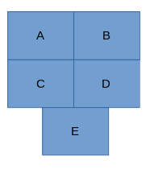
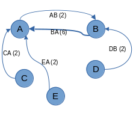
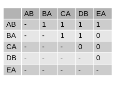
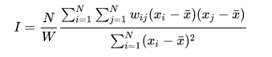
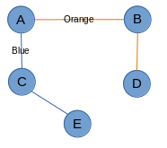
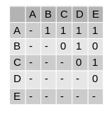
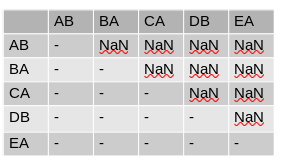
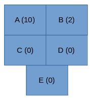

---
output:
  pdf_document: default
  html_document: default
---
# A Prediction on the Effect of the Proposed Triboro Line: Project Update  
Timothy Miller  
Dept. of Geography and Environmental Science, Hunter College  
GTECH 70500: Spatial Data Analysis  
Professor Jochen Albrecht  
November 1, 2022  

## Outline  
This report documents the progress made on during research into possible effects
of the proposed Triboro line on the transportation dynamics of Manhattan, The Bronx,
Brooklyn, and Queens- collective referred to as the boroughs of interest.  

The report will:  
- review the original research proposal  
- share results of the exploratory spatial data analysis  
- reexamine the research question  
- update the research goals and strategies  

## Original research proposal
The original research question examined the number of total trips that would be
generated by the Triboro line. It also attempted to quantify the total number of
trips that would be converted from cars to the subway. This proposal was
submitted on Sept 13. After being advised that I would need to provide an inventory
of data needs and a conceptual model, I resubmitted an updated project proposal on Sep 27.
This update included the conceptual model shown in Figure 1 and the data needs 
inventory shown in Table 1. After outlining a general research approach, I found
and examine relevant data with exploratory spatial data analysis.

  
*Figure 1: original conceptual model of transportation dynamics*  

  
*Table 2: original identified data needs inventory*   

## Exploratory Spatial Data Analysis  
After being provided the Longitudinal Employer-Household Dynamics (LEHD) 
Origin-Destination Employment Statistics (LODES) data and receiving the
spatial flows lecture, I began exploring the commute data for the 
boroughs of interest. The exploratory process helped direct the research question,
narrow the study area, and focus the statistical tests.

**Required libraries**  
```{r message = FALSE}
# Data cleaning and organizing
library(tidyverse)
# Import geojson in an sf compatible format 
library(geojsonsf)
# Manage spatial data
library(sf)
# Map the geospatial results
library(tmap)
# Prevent use of scientific notation for coordinates
options(scipen = 999)
```

**Required data (imported throughout the exploration process)**  
*- Origin and Destination data for NYS in 2019 at the block level*  
*- NYC census tract borders*  
*- Borders of NYC boroughs*  
*- Equivalency of neighborhood tabulation areas to census tracts*  

### Select the resolution of the study area.
LODES data are provided at the block level. However, the research question relates
to trips that require the highway or subway system. Census blocks for NYC are 
generally small enough that people can walk between them. Because the research
question is not interested in these trips, we can consolidate these trips into
census tracts. 

Figure 2 indicates that it is also feasible to walk between census tracts. 
We can general estimate the distance from the center of each tract to its edge.
This will help quantify census tract walk-ability. Let us consider a distance 
below 3000 meters to be walk-able. Though census tracts are irregularly shaped,
let us model them as circles to achieve a generally estimate. With this model,
we find the average census radius is around 1000 meters. This is well below our
walk-ability threshold.  

NYC provides a higher level of aggregation than the census tract. The Neighborhood
Tabulation Area (NTA) groups census tracts in a way that generally aligns with 
neighborhood boundaries within the city. They are mapped in Figure 3. They have an
estimated average radius of 3500 meters. NTAs generally represent the minimum 
distance for trips that would benefit from the subway or highway system. They 
will be used for the remaining analyses.

**Map borough of interest census tracts**  
```{r, message = FALSE}
bois_names <- c("Manhattan", "Bronx", "Brooklyn", "Queens")
bois_census_tract_borders <- geojson_sf('./data/nyc_2010_census_tract_borders.geojson') %>%
  dplyr::filter(BoroName %in% bois_names)
  
tmap::tm_shape(bois_census_tract_borders) + 
  tmap::tm_polygons(
    col = "BoroName",
    title = "Borough"
  )
```
*Figure 2: Map of census tracts for the boroughs of interest.*  

**Estimate the average distance from the center to the edge of tract**  
```{r, message = FALSE}
avg_tract_area <- sum(bois_census_tract_borders$Shape__Area)/ length(bois_census_tract_borders$Shape__Area)
avg_tract_radius <- sqrt(avg_tract_area/pi)
sprintf("Estimate of average distance from the center to the edge of a tract: %s m", avg_tract_radius)
```
**Map NTAs**  
```{r, message = FALSE}
# Map borough of interest ntas
bois_nta_borders <- geojson_sf('./data/nyc_2010_nta_borders.geojson') %>%
  dplyr::filter(BoroName %in% bois_names)

tmap::tm_shape(bois_nta_borders) +
  tmap::tm_polygons(
    col = "BoroName",
    title = "Borough"
  )
```
*Figure 3: Map of NTAs for boroughs of interest*  

**Estimate of average distance from center to edge of nta**  
```{r, message = FALSE}
avg_nta_area <- sum(bois_nta_borders$Shape__Area) / length(bois_nta_borders$Shape__Area)
avg_nta_radius <- sqrt(avg_nta_area/pi)
sprintf('Estimate of average distance from center to edge of nta: % s m', avg_nta_radius)
```

### Demonstrate the disparity between Manhattan and the other boroughs of interest 
After selecting NTAs as the boundaries, I began to explore the trip data for each
neighborhood. Before the exploratory process, I expected Midtown Manhattan to
have the greatest number of trips. However, I did not anticipate the disparity
between Midtown Manhattan and the rest of the boroughs of interest. Figure 4
shows that Midtown Manhattan has tens and even hundreds of thousands more 
trips than other neighborhoods. Figure 5 shows an overwhelming proportion of trips
end in Midtown Manhattan. This disparity would likely drown out the
transportation effects for other neighborhoods. As part of a discussion on Oct 14,
Professor Albrecht recommended I attempt to detect more subtle patterns by narrowing
the study area to a single borough. As part of this process, I explored the 
intra-borough travel patterns.

**Count the number of trips between neighborhoods of interest.**  
*The trips must start and end in the city. They must also start and end in different*  
*neighborhoods. Finally, we remove park ntas; they do not represent a single*  
*geographic area and they are not expected to have significant work commute activity.*  
```{r, message = FALSE}
# Create table to relate NTAs to their component census tracts
bois_county_tract_nta_equiv <- readxl::read_xlsx('./data/nyc_2010_census_tract_nta_equiv.xlsx') %>%
  filter(borough_name %in% bois_names) %>%
  mutate(county_tract = str_c(`county_code`, `census_tract`)) %>%
  select("county_tract", "nta_code")

# Reduce NYS origin destination data to only ntas of interest
bois_county_codes = c("061", "005", "047", "081") # Manhattan, Bronx, Brooklyn, Queens
bois_park_ntas <- c("BX10", "BX99", "BK99", "MN99", "QN99")
bois_nta_ods <- read_csv('./data/ny_od_main_JT00_2019.csv') %>%
  # Select only tracts within the boroughs of interest
  dplyr::filter(
    stringr::str_sub(as.character(w_geocode), 3, 5) %in% bois_county_codes &
      stringr::str_sub(as.character(h_geocode), 3, 5) %in% bois_county_codes
    ) %>%
  # Create fields specifically for home counties and tracts
  dplyr::mutate(w_county_tract = stringr::str_sub(as.character(w_geocode), 3, 11)) %>%
  dplyr::mutate(h_county_tract = stringr::str_sub(as.character(h_geocode), 3, 11)) %>%
  # Narrow table down to tracts and all jobs
  dplyr::select(h_county_tract, w_county_tract, S000) %>%
  # Relate tracts with ntas
  dplyr::left_join(bois_county_tract_nta_equiv, c("h_county_tract" = "county_tract")) %>%
  dplyr::rename(h_nta_code = nta_code) %>%
  dplyr::left_join(bois_county_tract_nta_equiv, c("w_county_tract" = "county_tract")) %>%
  dplyr::rename(w_nta_code = nta_code) %>%
  # Remove trips within the same nta, only inter-nta trips are of interest
  dplyr::filter(w_nta_code != h_nta_code) %>%
  # Remove trips involving park NTAs, they are not true neighborhoods 
  dplyr::filter(!(w_nta_code %in% bois_park_ntas) & !(h_nta_code %in% bois_park_ntas)) %>%
  # Label trips based on home and work ntas
  dplyr::mutate(od = str_c(h_nta_code, w_nta_code)) %>%
  # Count the number of trips made between these ntas and in this direction 
  dplyr::group_by(od) %>%
  dplyr::summarise(
    h_nta_code,
    w_nta_code,
    S000 = sum(S000),
    ) %>%
  # Remove duplicate entries
  unique()
```

**Map the distribution of work trips that end in each neighborhoods of interest.**  
```{r, message = FALSE}

## utility function
get_nta_dest <- function(ods_of_interest) {
  ods_of_interest %>%
    dplyr::group_by(w_nta_code) %>%
    dplyr::summarise(
      w_nta_code,
      S000 = sum(S000)
    ) %>%
    unique() %>%
    left_join(bois_nta_borders, c("w_nta_code" = "NTACode")) %>%
    st_as_sf() 
}

# reduce origin destination data to counts of trips ending in an nta
# associated these trips with the work nta geography
bois_nta_dest <- bois_nta_ods %>%
  dplyr::group_by(w_nta_code) %>%
  dplyr::summarise(
    w_nta_code,
    S000 = sum(S000)
  ) %>%
  unique() %>%
  left_join(bois_nta_borders, c("w_nta_code" = "NTACode")) %>%
  st_as_sf()

tmap::tm_shape(bois_nta_dest) +
  tmap::tm_polygons(
    col = "S000",
    style = "jenks",
    title = "Trips to work in NTA",
    legend.outside.width = 0.6
  ) +
  tmap::tm_layout(
    legend.outside = TRUE,
  )
```
*Figure 4: Distribution of work trips that end in each neighborhood.*  
*Each trip must start in the boroughs of interest. It must also end in a different*  
*neighborhood than it started.*  

**Define the desire lines for work trips throughout the boroughs of interest**
```{r, message=TRUE}
# Points on surface
bois_nta_pos <- bois_nta_borders %>%
  dplyr::mutate(geometry = sf::st_point_on_surface(geometry))

## utility function
get_nta_od_lines <- function(nta_ods_of_interest) {
 nta_ods_of_interest %>%
    dplyr::left_join(bois_nta_pos, c("h_nta_code" = "NTACode")) %>%
    dplyr::rename(h_geometry = geometry) %>%
    dplyr::left_join(bois_nta_pos, c("w_nta_code" = "NTACode")) %>%
    dplyr::rename(w_geometry = geometry) %>%
    dplyr::mutate(geometry = sf::st_union(h_geometry, w_geometry))%>%
    dplyr::mutate(geometry = sf::st_cast(geometry, "LINESTRING")) %>%
    dplyr::select("od", "S000", "geometry") %>%
    sf::st_as_sf() 
}

bois_nta_od_lines <- get_nta_od_lines(bois_nta_ods)

tmap::tm_shape(bois_nta_borders) +
  tmap::tm_polygons(
    col = "BoroName",
    title = "Borough",
  # Filter the desire lines to reduce their number and help pdf rendering
  ) + tmap::tm_shape(dplyr::filter(bois_nta_od_lines, S000 > 5000)) +
  tmap::tm_lines(
    col = "#212121",
    lwd = "S000",
    title.lwd = "Trips",
  ) + tmap::tm_layout(
    legend.outside = TRUE
  )
```
*Figure 5: Desire lines for inter-NTA trips*   

## Examine trips made within the same borough
To help select the borough to focus on, I examined trips that occur within each
borough. From Figure 6 and 7, Manhattan is still dominated by commutes to 
Midtown. However, the Bronx, Brooklyn, and Queens trips are more evenly distributed.
Looking at the total number of trips, Brooklyn has the most outside of Manhattan.
Manhattan has 508,873, the Bronx has 114,719, Brooklyn has 370256, and Queens has 265386.
As Brooklyn has the second most trips and these trips are distributed throughout
the borough, it will be used as the sole borough of interest for the rest of
the project. The decision to use Brooklyn was submitted on Oct 17. Because the
project is now focused on a single borough, it is uncertain whether the Triboro
line is still relevant. The next step is to examine what the updated research
question should be.

**Map the distribution of intra-borough trips that end in each NTA** 
```{r, message=FALSE}
## NTA borders for each borough
mn_nta_borders <- bois_nta_borders %>%
  dplyr::filter(BoroName == "Manhattan")
bx_nta_borders <- bois_nta_borders %>%
  dplyr::filter(BoroName == "Bronx")
bk_nta_borders <- bois_nta_borders %>%
  dplyr::filter(BoroName == "Brooklyn")
qn_nta_borders <- bois_nta_borders %>%
  dplyr::filter(BoroName == "Queens")

## Intra Borough trips 
intra_bois_nta_ods <- function(boro_abrv) {
  bois_nta_ods %>%
    dplyr::filter(
      stringr::str_sub(h_nta_code, 1,2) == boro_abrv &
      stringr::str_sub(w_nta_code, 1, 2) == boro_abrv
    )
}
mn_nta_ods <- intra_bois_nta_ods("MN")
bx_nta_ods <- intra_bois_nta_ods("BX")
bk_nta_ods <- intra_bois_nta_ods("BK")
qn_nta_ods <- intra_bois_nta_ods("QN")


## Most popular destinations for trips within a Borough
mn_nta_dest <- get_nta_dest(mn_nta_ods)
bx_nta_dest <- get_nta_dest(bx_nta_ods)
bk_nta_dest <- get_nta_dest(bk_nta_ods)
qn_nta_dest <- get_nta_dest(qn_nta_ods)
  
mn_dest_map <- tmap::tm_shape(mn_nta_dest) +
  tmap::tm_polygons(
    col = "S000",
    title = "Trip count"
  ) + tmap::tm_layout(
    legend.outside = TRUE,
    title = "Manhattan"
  )
bx_dest_map <- tmap::tm_shape(bx_nta_dest) +
  tmap::tm_polygons(
    col = "S000",
    title = "Trip count"
  ) + tmap::tm_layout(
    legend.outside = TRUE,
    title = "Bronx"
  )
bk_dest_map <- tmap::tm_shape(bk_nta_dest) +
  tmap::tm_polygons(
    col = "S000",
    title = "Trip count"
  ) + tmap::tm_layout(
    legend.outside = TRUE,
    title = "Brooklyn"
  )
qn_dest_map <- tmap::tm_shape(qn_nta_dest) +
  tmap::tm_polygons(
    col = "S000",
    title = "Trip count"
  ) + tmap::tm_layout(
    legend.outside = TRUE,
    title = "Queens"
  )
tmap::tmap_arrange(mn_dest_map, bx_dest_map, bk_dest_map, qn_dest_map, nrow = 2, ncol = 2)
```
*Figure 6: Intra-borough and Inter-NTA trips for the boroughs of interest*  


**Desire lines for intra borough trips**  
```{r, message=FALSE}
mn_nta_od_lines <- get_nta_od_lines(mn_nta_ods)
bx_nta_od_lines <- get_nta_od_lines(bx_nta_ods)
bk_nta_od_lines <- get_nta_od_lines(bk_nta_ods)
qn_nta_od_lines <- get_nta_od_lines(qn_nta_ods)

create_od_lines_map <- function(borders, lines, borough) {
  return(
    tmap::tm_shape(borders) +
 tmap::tm_polygons(
    col = "#ebebeb",
    title = borough
  ) + tmap::tm_shape(lines) +
  tmap::tm_lines(
    col = "#212121",
    lwd = "S000",
    title.lwd = "Trips"
  ) +
  tmap::tm_layout(
    legend.outside = TRUE
  )
  )
}

# Filter the desire lines to reduce their number and help pdf rendering
mn_nta_od_lines_map <- create_od_lines_map(mn_nta_borders,
                                           dplyr::filter(mn_nta_od_lines, S000 > 6000),
                                           "Manhattan"
                                           )
bx_nta_od_lines_map <- create_od_lines_map(bx_nta_borders,
                                           dplyr::filter(bx_nta_od_lines, S000 > 300),
                                           "Bronx"
                                           )
bk_nta_od_lines_map <- create_od_lines_map(bk_nta_borders,
                                           dplyr::filter(bk_nta_od_lines, S000 > 500),
                                           "Brooklyn"
                                           )
qn_nta_od_lines_map <- create_od_lines_map(qn_nta_borders,
                                           dplyr::filter(qn_nta_od_lines, S000 > 500),
                                           "Queens"
                                           )
tmap::tmap_arrange(
  mn_nta_od_lines_map,
  bx_nta_od_lines_map,
  bk_nta_od_lines_map,
  qn_nta_od_lines_map,
  nrow = 2,
  ncol = 2)
```
*Figure 7: Desire lines for intra-borough work trips*  
*Top left: Manhattan, Top Right: the Bronx*  
*Bottom left: Brooklyn, Bottom Right: Queens*  

**Total intra-borough trips for each borough of interest**  
```{r, message = FALSE}
print("Intra borough trips")
sprintf("Manhattan: % s", sum(mn_nta_ods$S000))
sprintf("Bronx: % s", sum(bx_nta_ods$S000))
sprintf("Brooklyn: % s", sum(bk_nta_ods$S000))
sprintf("Queens: % s", sum(qn_nta_ods$S000))
```

## Reexamination of researh question
After the exploratory data analysis, I had a better understanding of commuting
patterns throughout NYC. This helped me redefine the approach to the research
question. Professor Albrecht also directed me to examine Network Auto-correlation
and determine how it could fit into the examination.

For my research question, I am no longer attempting to predict an exact number of
trips that are generated by the Triboro line or converted from the highway system.
Instead, I am exploring whether the subway and highway systems have
an impact on work commutes throughout a borough. Additionally, I am exploring the
effect of commutes on neighboring commutes. In other words, do people work in
a location simply because everyone else works in that location?

To examine the question of commutes affecting neighboring commutes, I would like to 
perform network autocorrelation. In this model, each NTA is a node and its edges
are the presence of trips between two NTAs, or their desire lines.
Figures 8 through 11 demonstrate the creation of a network auto-correlation
neighborhood matrix. First, start with the NTAs as they exist in geographical space.
Then, graph the desire lines that connect them. From there, create an adjacency 
matrix to show the connections between NTAs. Finally, the neighborhood matrix is 
created by defining the arcs as the object of interest. Their neighbors are 
defined as those arcs which share an NTA as either an origin or destination. 
From the definition of Moran's I in Figure 12, we can see it requires a weight 
for each neighbor relationship and a value for each entity in the neighborhood. 
For the analysis, we will use the weights from the neighborhood matrix in 
Figure 11. We will also use the number of trips across the arc as its value.

  
*Figure 8: An example of NTAs in space*  

  
*Figure 9: An example origin and destination network between NTAs.*  
*Each arc is named after its connected NTAs.*  
*Its origin is the first letter and its destination is the second*  
*The number in parentheses represents the number of trips*  

  
*Figure 10: Connections between NTAs based on desire lines between them*  
*The weights of the connections are based on the number of trips*  

  
*Figure 11: Neighborhood matrix for desire line arcs*  
*Membership is defined as two arcs sharing an NTA*  

  
**Figure 12: Definition of Moran's I**   

In a discussion with Professor Albrecht on October 28, I proposed applying network
auto-correlation between the desire lines and several definitions for neighbor
relationships. These relationships include subway connections, street connections,
and queen contiguities. However, I believe I made a conceptual error with this 
proposal. I will illustrate my point with the subway definition. However, the
point applies to all neighbor definitions.

Figure 13 shows subway connections for the example NTAs. Figure 14 shows their
neighborhood matrix for the NTAs. In this example, two NTAs are neighbors if
one can reach the other using one subway line with no transfers. For this matrix,
there are not enough dimensions to represent the trips between the NTAs. Each NTA
only has enough dimensions to hold information about itself. 

We attempt to restore this dimension by using the arcs from the desire lines as 
the neighbors that need to be connected. This form is seen in Figure 15. However,
subways are meant as direct connections between two NTAs. They don't represent a
meaningful connection between neighboring desire line arcs.

Two tests will be required to fully represent the relationship between subways,
ntas, and desire lines. First, the value of each NTAs will be the total
number of trips which end in that NTA. This is illustrated in Figure 16. These
values will be paired with the NTA neighborhood matrix illustrated in Figure 14.
This auto-correlation will identify whether there are low job NTAs that are not 
Subway Neighbors with high job NTAs. However, it will not identify whether there 
is a relationship between the number of trips made between two NTAs and the 
presence of a Subway line. That will require a second test. For the second test,
I would run a regression with the presence of a subway connections as the 
independent variable and the number of trips along an arc as the dependent variable.

Road and queen contiguities would be conducive to these tests as well. I am still
researching the best definition of neighbor relationship based on road connections.
In addition to the global auto-correlation tests, I would perform corresponding
local auto-correlation tests.

  
*Figure 13: Subway lines for the example NTAs*  

  
*Figure 14: Neighborhood matrix for NTAs with subway connections as the*  
*definition for neighbor relationship*  

  
*Figure 15: Neighborhood matrix for desire line arcs with*  
*subway lines as the neighbor relationship definition*  

  
*Figure 16: Total number of trips ending in each NTA*  

## Updated research goals and strategies

The updated research project seeks to understand the relationship between
commutes, transportation systems, and physical space. The first statistical
test will be an network auto-correlation for desire lines. The next six 
statistical tests will be global and local auto-correlations on number of trips made to an NTA, 
with three definitions for neighbors. The first definition will be the presence
of a direct subway route. The second definition will be the presence of road
connections. The final definition will be queen contiguities. The last three
statistical tests will be regressions to determine the effect of each neighbor
relationship on the number of trips between those neighbors. All of these tests
will be performed on 2019 commute data for Brooklyn.

These questions are much more broad than the original proposal. This associated
data needs inventory is also simpler.
The total inventory is:
- Origin and Destination data for NYS in 2019 at the block level  
- NYC census tract borders  
- Borders of NYC boroughs  
- Equivalency of neighborhood tabulation areas to census tracts  
- Subway-based routes between NTAs
- Major street based routes between NTAs

All of the data have already been obtained, except the subway and 
major street routing data. These data can be obtained through open source or
proprietary routing services, such as Google.

With Dec 13 as the presentation deadline, the timeline of milestones follows:    
- Perform queen contiguity local and global auto-correlation, and regression (Nov 8th)  
  - Queen contiguity auto-correlation is the "traditional" approach. It is also
  does not require the routing data. Performing it first should help inform the 
  other analyses.  
- Perform subway contiguity local and glocal auto-correlation, and regression (Nov 15)  
  - This requires requests to a routing service to obtain the data. Making those
  api requests early will help identify potential problems while there is time 
  to adapt.  
- Perform major street contiguity local and global auto-correlation, and regression (Nov 22)  
- Perform network auto-correlation (Nov 29)
- Write report and presentation (Dec 6)  
  
The report will conclude with an examination of the findings and an identification
of "missing links" in the subway system. This might provide an opportunity to highlight
the Brooklyn segment of the Triboro line.