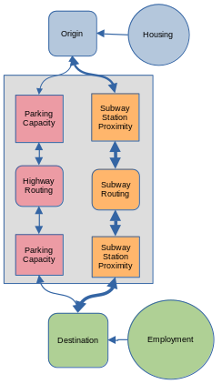
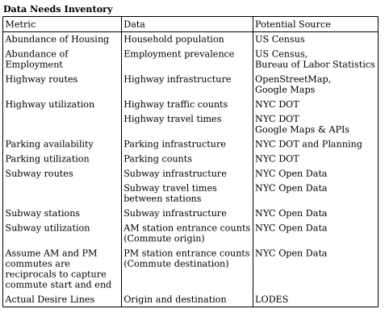

---
output:
  pdf_document: default
  html_document: default
---

# Outline
- Changes to the topic
  - Shift from trying to predict changes in dynamics to instead focusing on how much of an impact each travel mode makes
- Changes to the timeline
  - Need to create a timeline
  - retroactively mark when progress has been made. Look forward to what progress still needs to be done.
- Review of the original timeline: 
  - more detailed information on what has changed for the project
- A more detailed version of the methods to be applied.

# A Prediction on the Effect of the Proposed Triboro Line: Project Update
Timothy Miller  
Dept. of Geography and Environmental Science, Hunter College  
GTECH 70500: Spatial Data Analysis
Professor Jochen Albrecht
November 1, 2022

## Outline
This report documents the progress made on during research into possible effects
of the proposed Triboro line on the transportation dynamics of Manhattan, The Bronx,
Brooklyn, and Queens. The report will:
- review the original research proposal
- share results of the exploratory spatial data analysis
- explore the availability of required data
- reexamine the research question
- update the research goals and strategies

## Original Research Proposal
The original research question examined the number of total trips that would be
generated by the Triboro line. It also attempted to quantify the total number of
trips that would be converted from cars to the subway. This proposal was
submitted on Sept 13. After being advised that I would need to provide a list of
data needs and a conceptual, I resubmitted an updated project proposal on Sep 27
that included the conceptual model shown in Figure 1 and the list of data needs
shown in Table 1. After outlining a general research approach, I finding and 
examining relevant data.

  
Figure 1: original conceptual model of transportation dynamics  
  
Table 2: original identified data needs inventory  

## Exploratory Spatial Data Analysis
After being provided the Longitudinal Employer-Household Dynamics (LEHD) 
Origin-Destination Employment Statistics (LODES) data and receiving the
spatial flows lecture, I began exploring the commute data for the 
boroughs of interest. The exploratory process helped direct the research question,
narrow the study area, and focus the statistical tests.

Required libraries imported directly below
```{r message = FALSE}
# Data cleaning and organizing
library(tidyverse)
# Import geojson in an sf compatible format 
library(geojsonsf)
# Manage spatial data
library(sf)
# Map the geospatial results
library(tmap)
# Prevent use of scientific notation for coordinates
options(scipen = 999)
```

Required data imported throughout the exploration process
- Origin and Destination data for NYS in 2019 at the block level
- NYC census tract borders
- Borders of NYC boroughs
- Equivalency of neighborhood tabulation areas to census tracts

### Select the resolution of the study area.
LODES data are provided at the block level. However, the research question relates
to trips that require the highway or subway system. Census blocks for NYC are 
generally small enough that people can walk between them. Because the research
question is not interested in these trips, we can consolidate these trips into
census tracts. 

Figure 2 indicates that it is also feasible to walk between them. 
We can generally estimate the distance from the center of each tract to its edge.
This will help quantify inter-tract walk-ability. Let us consider a distance 
below 3000 meters to be walk-able. Though census tracts are irregularly shaped,
let us model them as circles to achieve a generally estimate. With this model,
we find the average census radius is around 1000 meters. This is well below our
walk-ability threshold.  

NYC provides a higher level of aggregation than the census tract. The Neighborhood
Tabulation Area (NTA) groups census tracts in a way that generally maps to 
neighborhoods throughout this city. They are mapped in Figure 3 and have an
estimated average radius of 3500 meters. NTAs generally represent the minimum 
distance for trips that would benefit from the subway or highway system. They 
will be used for the remaining analyses.

```{r, message = FALSE}
# Map borough of interest census tracts
bois_names <- c("Manhattan", "Bronx", "Brooklyn", "Queens")
bois_census_tract_borders <- geojson_sf('./data/nyc_2010_census_tract_borders.geojson') %>%
  dplyr::filter(BoroName %in% bois_names)
  
tmap::tm_shape(bois_census_tract_borders) + 
  tmap::tm_polygons(
    col = "BoroName",
    title = "Borough"
  )
```
Figure 2: Map of census tracts for the boroughs of interest.  

```{r, message = FALSE}
# Estimate the average distance from the center to the edge of tract
avg_tract_area <- sum(bois_census_tract_borders$Shape__Area)/ length(bois_census_tract_borders$Shape__Area)
avg_tract_radius <- sqrt(avg_tract_area/pi)
sprintf("Estimate of average distance from the center to the edge of a tract: %s m", avg_tract_radius)
```

```{r, message = FALSE}
# Map borough of interest ntas
bois_nta_borders <- geojson_sf('./data/nyc_2010_nta_borders.geojson') %>%
  dplyr::filter(BoroName %in% bois_names)

tmap::tm_shape(bois_nta_borders) +
  tmap::tm_polygons(
    col = "BoroName",
    title = "Borough"
  )
```
Figure 3: Map of NTAs for boroughs of interest  

```{r, message = FALSE}
# Estimate of average distance from center to edge of nta
avg_nta_area <- sum(bois_nta_borders$Shape__Area) / length(bois_nta_borders$Shape__Area)
avg_nta_radius <- sqrt(avg_nta_area/pi)
sprintf('Estimate of average distance from center to edge of nta: % s m', avg_nta_radius)
```
### Demonstrate the disparity between Manhattan and the other boroughs of interest 
After selecting NTAs as the boundaries, I began to explore the trip data for each
neighborhood. Before the exploratory process, I expected Midtown Manhattan to
have the greatest number of trips. However, I did not anticipate the disparity
between Midtown Manhattan and the rest of the boroughs of interest. Figure 4
shows that Midtown Manhattan has tens and even hundreds of thousands more 
trips than other neighborhoods. Figure 5 shows an overwhelming proportion of trips
end in Midtown Manhattan. This disparity would like drown out the
transportation effects for other neighborhoods. 

*Pre-process the data to count the number of trips between neighborhoods of interest.*
*The trips must start and end in the city. They must also start and end in different*
*neighborhoods. Finally, we remove park ntas; they do not represent a single*
*geographic area and they are not expected to have significant work commute activity.*
```{r, message = FALSE}
# Create table to relate NTAs to their component census tracts
bois_county_tract_nta_equiv <- readxl::read_xlsx('./data/nyc_2010_census_tract_nta_equiv.xlsx') %>%
  filter(borough_name %in% bois_names) %>%
  mutate(county_tract = str_c(`county_code`, `census_tract`)) %>%
  select("county_tract", "nta_code")

# Reduce NYS origin destination data to only ntas of interest
bois_county_codes = c("061", "005", "047", "081") # Manhattan, Bronx, Brooklyn, Queens
bois_park_ntas <- c("BX10", "BX99", "BK99", "MN99", "QN99")
bois_nta_ods <- read_csv('./data/ny_od_main_JT00_2019.csv') %>%
  # Select only tracts within the boroughs of interest
  dplyr::filter(
    stringr::str_sub(as.character(w_geocode), 3, 5) %in% bois_county_codes &
      stringr::str_sub(as.character(h_geocode), 3, 5) %in% bois_county_codes
    ) %>%
  # Create fields specifically for home counties and tracts
  dplyr::mutate(w_county_tract = stringr::str_sub(as.character(w_geocode), 3, 11)) %>%
  dplyr::mutate(h_county_tract = stringr::str_sub(as.character(h_geocode), 3, 11)) %>%
  # Narrow table down to tracts and all jobs
  dplyr::select(h_county_tract, w_county_tract, S000) %>%
  # Relate tracts with ntas
  dplyr::left_join(bois_county_tract_nta_equiv, c("h_county_tract" = "county_tract")) %>%
  dplyr::rename(h_nta_code = nta_code) %>%
  dplyr::left_join(bois_county_tract_nta_equiv, c("w_county_tract" = "county_tract")) %>%
  dplyr::rename(w_nta_code = nta_code) %>%
  # Remove trips within the same nta, only inter-nta trips are of interest
  dplyr::filter(w_nta_code != h_nta_code) %>%
  # Remove trips involving park NTAs, they are not true neighborhoods 
  dplyr::filter(!(w_nta_code %in% bois_park_ntas) & !(h_nta_code %in% bois_park_ntas)) %>%
  # Label trips based on home and work ntas
  dplyr::mutate(od = str_c(h_nta_code, w_nta_code)) %>%
  # Count the number of trips made between these ntas and in this direction 
  dplyr::group_by(od) %>%
  dplyr::summarise(
    h_nta_code,
    w_nta_code,
    S000 = sum(S000),
    ) %>%
  # Remove duplicate entries
  unique()
```

Map the distribution of work trips that end in each neighborhoods of interest.
```{r, message = FALSE}

## utility function
get_nta_dest <- function(ods_of_interest) {
  ods_of_interest %>%
    dplyr::group_by(w_nta_code) %>%
    dplyr::summarise(
      w_nta_code,
      S000 = sum(S000)
    ) %>%
    unique() %>%
    left_join(bois_nta_borders, c("w_nta_code" = "NTACode")) %>%
    st_as_sf() 
}

# reduce origin destination data to counts of trips ending in an nta
# associated these trips with the work nta geography
bois_nta_dest <- bois_nta_ods %>%
  dplyr::group_by(w_nta_code) %>%
  dplyr::summarise(
    w_nta_code,
    S000 = sum(S000)
  ) %>%
  unique() %>%
  left_join(bois_nta_borders, c("w_nta_code" = "NTACode")) %>%
  st_as_sf()

tmap::tm_shape(bois_nta_dest) +
  tmap::tm_polygons(
    col = "S000",
    style = "jenks",
    title = "Trips to work in NTA",
    legend.outside.width = 0.6
  ) +
  tmap::tm_layout(
    legend.outside = TRUE,
  )
```
Figure 4: Distribution of work trips that end in each neighborhood.
Each trip must start in the boroughs of interest. It must also end in a different
neighborhood than it started.  

Define the desire lines for work trips throughout the boroughs of interest
```{r, message=TRUE}
# Points on surface
bois_nta_pos <- bois_nta_borders %>%
  dplyr::mutate(geometry = sf::st_point_on_surface(geometry))

## utility function
get_nta_od_lines <- function(nta_ods_of_interest) {
 nta_ods_of_interest %>%
    dplyr::left_join(bois_nta_pos, c("h_nta_code" = "NTACode")) %>%
    dplyr::rename(h_geometry = geometry) %>%
    dplyr::left_join(bois_nta_pos, c("w_nta_code" = "NTACode")) %>%
    dplyr::rename(w_geometry = geometry) %>%
    dplyr::mutate(geometry = sf::st_union(h_geometry, w_geometry))%>%
    dplyr::mutate(geometry = sf::st_cast(geometry, "LINESTRING")) %>%
    dplyr::select("od", "S000", "geometry") %>%
    sf::st_as_sf() 
}

bois_nta_od_lines <- get_nta_od_lines(bois_nta_ods)

tmap::tm_shape(bois_nta_borders) +
  tmap::tm_polygons(
    col = "BoroName",
    title = "Borough",
  ) + tmap::tm_shape(dplyr::filter(bois_nta_od_lines, S000 > 5000)) +
  tmap::tm_lines(
    col = "#212121",
    lwd = "S000",
    title.lwd = "Trips",
  ) + tmap::tm_layout(
    legend.outside = TRUE
  )
```
Figure 5: Desire lines for inter-NTA trips  

## Examine trips made within the same borough


Define the most origin destination profiles for trips within the same borough
```{r, message=FALSE}
## NTA borders for each borough
mn_nta_borders <- bois_nta_borders %>%
  dplyr::filter(BoroName == "Manhattan")
bx_nta_borders <- bois_nta_borders %>%
  dplyr::filter(BoroName == "Bronx")
bk_nta_borders <- bois_nta_borders %>%
  dplyr::filter(BoroName == "Brooklyn")
qn_nta_borders <- bois_nta_borders %>%
  dplyr::filter(BoroName == "Queens")

## Intra Borough trips 
intra_bois_nta_ods <- function(boro_abrv) {
  bois_nta_ods %>%
    dplyr::filter(
      stringr::str_sub(h_nta_code, 1,2) == boro_abrv &
      stringr::str_sub(w_nta_code, 1, 2) == boro_abrv
    )
}
mn_nta_ods <- intra_bois_nta_ods("MN")
bx_nta_ods <- intra_bois_nta_ods("BX")
bk_nta_ods <- intra_bois_nta_ods("BK")
qn_nta_ods <- intra_bois_nta_ods("QN")


## Most popular destinations for trips within a Borough
mn_nta_dest <- get_nta_dest(mn_nta_ods)
bx_nta_dest <- get_nta_dest(bx_nta_ods)
bk_nta_dest <- get_nta_dest(bk_nta_ods)
qn_nta_dest <- get_nta_dest(qn_nta_ods)
  
mn_dest_map <- tmap::tm_shape(mn_nta_dest) +
  tmap::tm_polygons(
    col = "S000",
    title = "Trip count"
  ) + tmap::tm_layout(
    legend.outside = TRUE,
    title = "Manhattan"
  )
bx_dest_map <- tmap::tm_shape(bx_nta_dest) +
  tmap::tm_polygons(
    col = "S000",
    title = "Trip count"
  ) + tmap::tm_layout(
    legend.outside = TRUE,
    title = "Bronx"
  )
bk_dest_map <- tmap::tm_shape(bk_nta_dest) +
  tmap::tm_polygons(
    col = "S000",
    title = "Trip count"
  ) + tmap::tm_layout(
    legend.outside = TRUE,
    title = "Brooklyn"
  )
qn_dest_map <- tmap::tm_shape(qn_nta_dest) +
  tmap::tm_polygons(
    col = "S000",
    title = "Trip count"
  ) + tmap::tm_layout(
    legend.outside = TRUE,
    title = "Queens"
  )
tmap::tmap_arrange(mn_dest_map, bx_dest_map, bk_dest_map, qn_dest_map, nrow = 2, ncol = 2)
```

Total trips in each borough
```{r, message = FALSE}
print("Intra borough trips")
sprintf("Manhattan: % s", sum(mn_nta_ods$S000))
sprintf("Bronx: % s", sum(bx_nta_ods$S000))
sprintf("Brooklyn: % s", sum(bk_nta_ods$S000))
sprintf("Queens: % s", sum(qn_nta_ods$S000))
```

Desire lines for intra borough trips
```{r, message=FALSE}
mn_nta_od_lines <- get_nta_od_lines(mn_nta_ods)
bx_nta_od_lines <- get_nta_od_lines(bx_nta_ods)
bk_nta_od_lines <- get_nta_od_lines(bk_nta_ods)
qn_nta_od_lines <- get_nta_od_lines(qn_nta_ods)

create_od_lines_map <- function(borders, lines, borough) {
  return(
    tmap::tm_shape(borders) +
 tmap::tm_polygons(
    col = "#ebebeb",
    title = borough
  ) + tmap::tm_shape(lines) +
  tmap::tm_lines(
    col = "#212121",
    lwd = "S000",
    title.lwd = "Trips"
  ) +
  tmap::tm_layout(
    legend.outside = TRUE
  )
  )
}

mn_nta_od_lines_map <- create_od_lines_map(mn_nta_borders,
                                           dplyr::filter(mn_nta_od_lines, S000 > 6000),
                                           "Manhattan"
                                           )
bx_nta_od_lines_map <- create_od_lines_map(bx_nta_borders,
                                           dplyr::filter(bx_nta_od_lines, S000 > 300),
                                           "Bronx"
                                           )
bk_nta_od_lines_map <- create_od_lines_map(bk_nta_borders,
                                           dplyr::filter(bk_nta_od_lines, S000 > 500),
                                           "Brooklyn"
                                           )
qn_nta_od_lines_map <- create_od_lines_map(qn_nta_borders,
                                           dplyr::filter(qn_nta_od_lines, S000 > 500),
                                           "Queens"
                                           )
tmap::tmap_arrange(
  mn_nta_od_lines_map,
  bx_nta_od_lines_map,
  bk_nta_od_lines_map,
  qn_nta_od_lines_map,
  nrow = 2,
  ncol = 2)
```


### Updated approach
- Network auto-correlation of OD desire lines for 2019
- Network auto-correlation of MTA system
- Network auto-correlation of Highway system
- Network correlation of contiguous NTAs
- Regression to compare the MTA and Highway systems, to see which has the greatest effect
- Is there are way to measure the shift in the networks?

Started with interest in Triboro line ridership
- Interest in the four boroughs that are severed by the subway system
- Manhattan overwhelms the travel patterns throughout the boroughs of interest
- Insufficient data to track the total ridership and the means 
  - Travel surveys did not offer the level of detail or confidence
- Shifted to looking specifically at work commuting patterns within a single borough
- Focused on what correlation each transporation system has with the OD patterns
